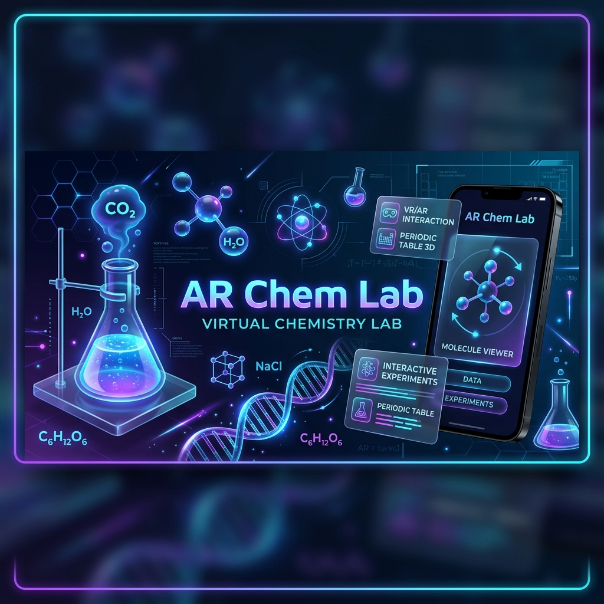

<div align="center">
  

  <br />

  [](https://flutter.dev/)
  [](https://dart.dev/)
  [](https://unity.com/)
  [](https://blog.cleancoder.com/uncle-bob/2012/08/13/the-clean-architecture.html)

  <h1>🧪 AR Chem Lab</h1>

  <p>
    <strong>A high-fidelity Augmented Reality Chemistry Laboratory.</strong><br />
    Bringing the wonders of science to life through Flutter and Unity integration.
  </p>
</div>

---

## 🌟 Overview

**AR Chem Lab** is a cutting-edge educational application designed to bridge the gap between theoretical chemistry and practical experimentation. By leveraging **Augmented Reality (AR)**, the app allows users to perform dangerous, expensive, or complex chemical reactions safely within their own environment.

Built with a **Premium UI/UX** philosophy, it combines the fluid animations of Flutter with the powerful 3D rendering capabilities of Unity to create an immersive learning ecosystem.

---

## ✨ Core Features

### 🥽 Augmented Reality Laboratory
- **Native Unity Integration:** Seamlessly transition between Flutter UI and Unity AR scenes.
- **Interactive Experiments:** Conduct real-time chemical reactions with accurate visual effects.
- **Safety First:** Explore high-risk reactions (like alkali metals in water) without physical danger.

### 🧬 Professional 3D Molecular Viewer
- **Interactive Models:** Rotate, zoom, and inspect 100+ molecular structures.
- **Atomic Precision:** High-fidelity 3D assets ensuring scientific accuracy.
- **Powered by `model_viewer_plus`:** Utilizing modern glTF rendering for smooth performance.

### 🤖 AI Chemistry Assistant
- **Smart Tutor:** Integrated chatbot to assist with experiment walkthroughs and scientific queries.
- **Markdown Support:** Clean rendering of chemical formulas ($H_2O$), tables, and structured data.
- **Thinking Animations:** Engaging UI feedback while the AI processes complex answers.

### 📊 Dynamic Periodic Table
- **Interactive Elements:** Comprehensive data on every element, including atomic mass, boiling points, and electron configurations.
- **Deep Dives:** Dedicated detail screens for each element with beautifully styled data cards.

### 🎓 Gamified Learning Paths
- **Level-Based Progression:** Adaptive difficulty across *Beginner*, *Intermediate*, and *Expert* levels.
- **Progress Tracking:** Secure user profiling and experiment history.

---

## 🛠️ Technology Stack

| Layer | Technology |
|---|---|
| **Frontend** | [Flutter](https://flutter.dev/) |
| **AR/3D Engine** | [Unity](https://unity.com/) (UaaL) |
| **State Management** | [BLoC / Cubit](https://bloclibrary.dev/) |
| **Dependency Injection** | `get_it` & `injectable` |
| **Networking** | `Dio` with interceptors |
| **UI Utilities** | `flutter_screenutil`, `google_fonts`, `awesome_dialog` |

---

## 🏗️ Architecture

The project adheres to **Clean Architecture** principles, ensuring a scalable and maintainable codebase:

- **Presentation Layer:** Feature-first organization. Each feature (auth, lab, chat) contains its own Cubits/BLoCs and Screens.
- **Domain Layer:** Pure Dart logic containing Entities, Use Case definitions, and Repository interfaces.
- **Data Layer:** Implementation of repositories, DTOs (Data Transfer Objects), and various data sources (API/Local).
- **Core Layer:** Shared components, theme constants, and cross-cutting utilities.

---

## 🚀 Getting Started

### Prerequisites
- **Flutter SDK:** `^3.10.7`
- **Unity Hub:** Version `2022.3.x` (recommended)
- **NDK:** `23.1.7779620` (required for Unity integration)

### Installation

1. **Clone the Project**
   ```bash
   git clone https://github.com/Mustafa-Mohamed26/ar_chem_lab.git
   ```

2. **Initialize Flutter Dependencies**
   ```bash
   flutter pub get
   ```

3. **Generate Source Code (DI & Routing)**
   ```bash
   flutter pub run build_runner build --delete-conflicting-outputs
   ```

4. **Unity Integration**
   - Ensure the `unityExport` folder is correctly linked as per the [Unity Integration Guide](UNITY_INTEGRATION_README.md).
   - Set up the NDK path in your local environment.

5. **Run the App**
   ```bash
   flutter run
   ```

---

## 📸 Visual Identity

<div align="center">
  <table>
    <tr>
      <td><b>Dashboard</b></td>
      <td><b>AR Lab</b></td>
      <td><b>AI Assistant</b></td>
    </tr>
    <tr>
      <td></td>
      <td></td>
      <td></td>
    </tr>
  </table>
</div>

---

## 🤝 Contributing
We welcome contributions! Please follow the standard fork-and-pull-request workflow.

1. Fork the Project
2. Create your Feature Branch (`git checkout -b feature/AmazingFeature`)
3. Commit your Changes (`git commit -m 'Add some AmazingFeature'`)
4. Push to the Branch (`git push origin feature/AmazingFeature`)
5. Open a Pull Request

---

<p align="center">
  <i>Developed with ❤️ by the Mustafa Mohamed's Team.</i><br />
  <i>Making Chemistry Interactive, Immersive, and Accessible.</i>
</p>
